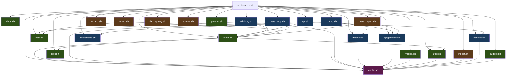
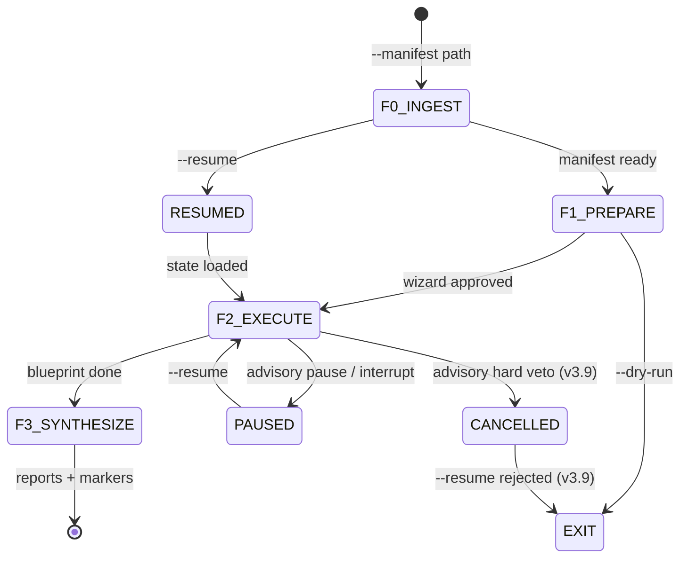

# FORMICA v4.0 — Source of Truth

```yaml
# Machine-parseable frontmatter
version: "4.0"
codename: "Ship-Ready Autonomous Engine"
files:
  total: 39
  bash: 27
  workers: 8
  schemas: 4
  tests: 3
  config: 1
lines:
  total: ~9000
  bash: ~7200
  workers: 335
  schemas: 210
  tests: ~750
  config: ~180
test_results:
  total_blueprints_run: 19
  complex_first_pass: "62%"
  complex_completion: "75%"
  last_test_cost: "$0.30"
  sprint_gate_v38: "20/20 PASS"
  sprint_gate_v39: "14/14 PASS"
  config_backward_compat: "142/142 PASS"
  adversarial_suite: "28/28 PASS"
  total_assertions: 190
known_gaps: 2
untested_functions: 11
biomimetic_patterns: 6
last_updated: "2026-02-19"
```

---

## 1. Architecture Overview

### 1.1 System Identity

FORMICA is a bash-based autonomous execution engine that orchestrates Claude Code workers
through a biologically-inspired pipeline. It transforms ATHENA blueprints into executed
project artifacts by spawning isolated `claude -p` worker processes, scoring their output
through a 3-layer immune system, routing verdicts through deterministic decision logic,
and adapting strategy through pheromone, friction, advisory, and epigenetic feedback loops.
Every decision except worker output and QA scoring is deterministic bash — 2 LLM calls per task.

**v4.0:** All 150+ hardcoded thresholds externalized to `formiga.config.yaml` via `config_read()`.
When config file is absent, every value falls back to its hardcoded default — zero behavioral change.

### 1.2 Module Map

```
.orchestrator/                              # Root — ~9000 lines across 39 files
├── orchestrate.sh              [1643]      # Main: F0-F3 lifecycle, Ralph Loop, meta-supervisor
├── formiga.config.yaml          [180]      # v4.0: Centralized config (15 sections, 150+ values)
├── VERSION                        [1]      # v4.0: Semver version file
├── RELEASE-v4.0.md              [120]      # v4.0: Changelog, migration guide
├── lib/                                    # ── CORE LAYER ──
│   ├── config.sh                 [28]      # v4.0: config_read() — yq extraction with fast-path fallback
│   ├── state.sh                 [381]      # State CRUD, CAS version counter, atomic write+read, task queries
│   ├── deps.sh                  [250]      # DAG validation, cycle detection, wave computation
│   ├── cost.sh                  [193]      # Cost tracking, atomic budget reserve/reconcile
│   ├── budget.sh                [250]      # Token estimation, safety budget, cost prediction
│   ├── lock.sh                   [56]      # File-based locking, stale lock detection
│   ├── utils.sh                 [135]      # Logging, color, normalize_path, append_jsonl
│   ├── parallel.sh               [79]      # Process reaping, kill_all, running count
│   ├── modes.sh                  [87]      # Orchestration modes (economic/quality/speed/guided)
│   │                                       # ── INTELLIGENCE LAYER ──
│   ├── context.sh               [528]      # 8-layer context pack, token budget truncation
│   ├── routing.sh               [315]      # Model selection, allometry, negative pheromone
│   ├── qa.sh                    [430]      # 3-layer immune system, QA scoring, verdict routing
│   ├── advisory.sh              [204]      # Inter-wave coherence review, adjustment application
│   ├── friction.sh              [179]      # Friction classification (8 categories), trend analysis
│   ├── pheromone.sh              [86]      # Running average QA scores, evaporation
│   ├── epigenetics.sh           [260]      # Cross-blueprint markers, budget/model hints
│   ├── meta_loop.sh             [287]      # Quorum sensing, sigmoid decision, cycle management
│   │                                       # ── EXECUTION SUPPORT ──
│   ├── ingest.sh                [178]      # F0: Blueprint → compat manifest conversion
│   ├── wizard.sh                [271]      # F1: Pre-execution display, DAG waves, cost estimate
│   ├── report.sh                [738]      # F3: execution-report.md, file-manifest.md
│   ├── meta_report.sh           [891]      # F3: diagnostic.json, handoff.yaml, pattern staging
│   ├── file_registry.sh         [184]      # File conflict detection (F0)
│   └── athena.sh                [189]      # ATHENA integration: patterns, decay, promotion
├── workers/                                # ── WORKER DNA ──
│   ├── _base.md                  [46]      # Universal protocol: zero preamble, Write tool
│   ├── analyst.md                [42]      # Scout — structured analysis, quantification
│   ├── architect.md              [36]      # Designer — trade-off analysis, specifications
│   ├── writer.md                 [33]      # Scribe — documentation, direct prose
│   ├── implementer.md            [33]      # Builder — production code, style matching
│   ├── qa.md                     [50]      # Sentinel — calibrated scoring, colony signals
│   ├── advisor.md                [53]      # Advisor — cross-task coherence, adversarial
│   └── forger.md                 [42]      # Re-forger — blueprint improvement from failures
├── schemas/                                # ── JSON SCHEMAS ──
│   ├── qa-verdict.json           [53]      # score(0-100), verdict(PASS|REWORK|REJECT), feedback
│   ├── state.json                [57]      # blueprint_id, tasks{}, counters{}, budget{}
│   ├── advisory-review.json      [42]      # coherence_score(0-10), quality_trend, adjustments
│   └── meta-report.json          [58]      # trend, systemic_issues, pattern_updates, health
├── tests/                                  # ── TEST SUITES (v3.8+) ──
│   ├── sprint-gate-v38.sh       [332]      # 20 assertions: CAS, budget, QA coherence, routing
│   ├── test-config-defaults.sh  [~200]     # 142 assertions: backward compat (no config → defaults)
│   └── test-adversarial-suite.sh [535]     # 28 assertions: 6 adversarial campaigns
├── memory/
│   └── epigenetic-markers.yaml             # Cross-blueprint learning (budget/model hints)
├── docs/
│   └── FORMICA-SOURCE-OF-TRUTH.md          # This file
└── campaigns/                              # Blueprint input templates
```

### 1.3 Module Dependency Graph



**v4.0 change:** `config.sh` is now a foundational dependency. All 16 lib files call `config_read()`. The function is safe to call before config.sh is sourced (returns default via second argument).

### 1.4 Key Design Decisions

| Decision | Rationale | Consequence |
|----------|-----------|-------------|
| `claude -p` for workers | Isolated context per task, no session contamination | No shared state between workers; each gets exactly its context pack |
| `mkdir -p` as lock primitive | Atomic on all filesystems, no external deps | Stale lock detection needed (PID file inside lock dir) |
| JSONL for telemetry | Append-only, concurrent-safe, `jq -s` for batch reads | Single malformed line poisons downstream `jq -s` reads |
| JSON for state | `jq` atomic read-modify-write via temp file + mv | CAS version counter + mkdir lock (v3.8: state_write_and_read for atomic check+extract) |
| `set +e` in `execute_task` | Background subshell inherits `set -euo pipefail` from parent | Without this, any non-zero return kills the entire task silently |
| Config externalization (v4.0) | 150+ hardcoded values scattered across 16 files | `config_read("key", "default")` with fast-path when no config file |

---

## 2. Lifecycle: F0 through F3

### 2.1 F0: INGEST (`orchestrate.sh:1425-1470`, `ingest.sh:27-178`)

**Input:** Blueprint directory path (contains `_metadata.yaml`, task files)
**Process:** Validate blueprint structure, generate compatibility manifest in runtime dir
**Output:** `runtime/{bp-id}/manifest.yaml` — single YAML consumed by all downstream phases

Key steps in `generate_compat_manifest()`:
1. Read `_metadata.yaml` for blueprint ID, budget, config
2. Read all task YAML files from blueprint directory
3. Merge into single manifest with workers, config, tasks array
4. Validate: all task IDs unique, all `depends_on` refs exist, no cycles
5. Write to `runtime/{bp-id}/manifest.yaml`

**Flags:** `--resume` skips re-generation, `--restart` cleans runtime, `--abandon` removes runtime

### 2.2 F1: PREPARE (`orchestrate.sh:1559-1566`)

**Validate:** `validate_manifest()` (:179-358) checks 12 fields: id, workers, tasks, deps, budget
**Wizard:** `run_wizard()` (wizard.sh:16-111) displays DAG waves, cost estimate, confirmation
**Allometry:** `apply_allometry()` (routing.sh:23-51) sets MAX_PARALLEL, MAX_RETRIES, ADVISORY_ENABLED based on colony size (small ≤8, medium ≤25, large >25)
**Epigenetics:** `load_markers()` (epigenetics.sh:49-91) loads budget adjustments and model hints

### 2.3 F2: EXECUTE (`orchestrate.sh:1568-1592`)

**Core loop:** `run_blueprint()` (:543-688) — polling loop with 2-second sleep
**Meta-loop:** Optional wrapper `run_meta_loop()` (meta_loop.sh:155-219) — max 2 auto-cycles

The wave loop detects transitions when the ready set changes and no workers are running.
Between waves: advisory review → allometry adaptation → pheromone evaporation.
Within waves: parallel dispatch up to MAX_PARALLEL, pre-spawn immune barriers, budget checks.

### 2.4 F3: SYNTHESIZE (`orchestrate.sh:1497-1529`)

| Output | Generator | Format | Consumer |
|--------|-----------|--------|----------|
| execution-report.md | `report.sh:generate_execution_report()` | Markdown | Human |
| file-manifest.md | `report.sh:generate_file_manifest()` | Markdown | Human |
| diagnostic.json | `meta_report.sh:generate_diagnostic_json()` | JSON | ATHENA/Meta-loop |
| handoff.yaml | `meta_report.sh:generate_handoff_yaml()` | YAML | Next blueprint |
| epigenetic-markers.yaml | `epigenetics.sh:update_markers()` | YAML | Next blueprint |
| AURUM feedback | `orchestrate.sh:1614-1629` | YAML | Cognitive Refinery |

### 2.5 Lifecycle State Machine



---

## 3. The Ralph Loop

The core execution cycle for each task. Lives in `execute_task()` at `orchestrate.sh:694-1155`.
Named after the feedback loop: Result → Assess → Loop-back → Pass/Halt.

### 3.1 Flow Diagram

```
execute_task(task_id)
│
├─ 1. SETUP (694-793)
│  ├─ Read manifest: worker, model, description, output, budget, qa config
│  ├─ Apply epigenetic budget adjustment (get_budget_adjustment)
│  ├─ Calculate safety budget (estimate_task_cost → calculate_safety_budget)
│  ├─ Apply criticality: blocking_factor ≥ 3 → budget × 1.5
│  ├─ Route model: select_model(worker, retries, budget%, task_override)
│  ├─ Resolve paths, get context_files, qa_criteria
│  └─ Analyst safety gate: empty context_files → tools=WebSearch,WebFetch
│
├─ 2. ATTEMPT LOOP (800-1152)
│  │
│  ├─ 2a. Context assembly (825-830)
│  │  └─ assemble_context_pack → 8-layer markdown file
│  │
│  ├─ 2b. Worker spawn (836-873)
│  │  ├─ Clear stale output file
│  │  ├─ claude -p with: --append-system-prompt, --model, --max-budget-usd,
│  │  │   --tools, --setting-sources "", --output-format json, --no-session-persistence
│  │  └─ Validate response JSON (empty → synthetic error, invalid → wrap raw)
│  │
│  ├─ 2c. Cost recording (877-903)
│  │  ├─ Extract cost, input_tokens, output_tokens from response
│  │  ├─ Budget-kill detection: result=null + cost ≥ 90% budget
│  │  └─ Adaptive scaling: budget × 1.5 for next attempt
│  │
│  ├─ 2d. Output extraction (905-923)
│  │  ├─ Check if worker wrote to output_path via tools
│  │  ├─ If not: extract .result from JSON response
│  │  └─ Strip preamble for markdown (sed -n '/^#/,$p')
│  │
│  ├─ 2e. IMMUNE LAYER 2: Innate check (967-989)
│  │  ├─ File exists? Non-empty? Size 10B-500KB?
│  │  ├─ Format validation (json/yaml/sh/md) — inferred from extension
│  │  ├─ Line count ±30%-300% of expected
│  │  ├─ Preamble detection (first line grep)
│  │  └─ Immune memory pattern matching
│  │
│  ├─ 2f. IMMUNE LAYER 2.5: Blacklist check (991-1004)
│  │  └─ check_blacklist_violations against hard constraints
│  │
│  ├─ 2g. Syntax pre-check (1006-1025)
│  │  └─ implementer + .sh → bash -n (deterministic, saves $0.02)
│  │
│  ├─ 2h. QA scoring (1027-1048)
│  │  ├─ run_qa: spawn QA worker with --json-schema qa-verdict.json
│  │  └─ Colony signal extraction from QA response
│  │
│  ├─ 2i. Worker signal extraction (1058-1078)
│  │  └─ grep <!-- SIGNAL: type | message | intensity --> from output
│  │
│  ├─ 2j. Verdict routing (1080-1151)
│  │  ├─ parse_verdict: 3-strategy extraction (structured → JSON → regex)
│  │  ├─ record_pheromone(worker_type, model, score)
│  │  ├─ route_verdict → 0=PASS, 1=REWORK, 2=REJECT
│  │  ├─ extract_friction_event on non-PASS
│  │  └─ Model escalation after 2 consecutive failures on same model
│  │
│  └─ Return: 0=success, 1=failure
```

### 3.2 Model Routing Cascade (`routing.sh:125-207`)

`select_model()` evaluates 7 factors in priority order (first match wins):

| Priority | Factor | Logic | Source |
|----------|--------|-------|--------|
| 1 | **Budget < 30%** | Force haiku (gateway tasks exempt if blocking_factor≥3) | state.json budget |
| 2 | Per-task override | `task.model` in manifest (validated: haiku\|sonnet\|opus) | Manifest YAML |
| 3 | Epigenetic hint | `get_model_hint(worker_type)` | epigenetic-markers.yaml |
| 4 | Friction ≥ 2 events | Upgrade to sonnet | friction_events.jsonl |
| 5 | Pheromone MMAS | `sonnet_score/(haiku+sonnet) ≥ 0.6` → sonnet | pheromone_table.json |
| 6 | Retry ≥ 1 | haiku→sonnet (never auto-opus) | Task attempt count |
| 7 | Default | `$DEFAULT_MODEL` (initially from manifest) | Global variable |

**v3.8 change:** Budget guard moved to priority 1 (was 3). Per-task override now validated (unknown model names → warning + default).

### 3.3 Context Pack Architecture (`context.sh:9-67`)

8 layers assembled into a single markdown file, with truncation when over token budget:

| Layer | Content | Truncation Priority |
|-------|---------|-------------------|
| L0 | Project conventions (from CLAUDE.md, max 15 lines) | LAST (keep) |
| L1 | Task spec + acceptance criteria + output path | NEVER truncate |
| L2 | Negative pheromone soft constraints | MID |
| L3 | Domain/genius kit + AURUM exports | FIRST after L5 |
| L4 | Reference files (context_files from manifest) | MID |
| L5 | Colony signals (trophallaxis) | FIRST to truncate |
| L6 | QA rubric + threshold | KEEP early |
| L6.5 | Historical friction warnings for worker type | MID |
| L7 | Retry feedback (previous attempt) | NEVER truncate |

Token budget: power-law `60000 * (8/n)^0.75` per task count, floor 3000.

**v3.9 change:** `estimate_tokens()` now uses type-aware ratios (bash: wc-w × 7.9, md: × 6.5, json/yaml: × 5.2). Truncation order: L5 → L3 → L6.5 → L4 → L2 → L0.

### 3.4 Three-Layer Immune System (`qa.sh`)

| Layer | When | What | Location |
|-------|------|------|----------|
| 1. Pre-spawn barriers | Before worker spawn | Budget sufficient? Worker DNA exists? Output dir writable? | qa.sh:14-52 |
| 2. Innate immune | After worker, before QA | File exists? Format valid? Size sane? Preamble? Line count? Memory? | qa.sh:56-151 |
| 3. Adaptive (QA) | LLM-based scoring | Score 0-100 against criteria, structured JSON verdict | qa.sh:186-272 |

**v3.9 change:** `promote_immune_memory()` called per wave, deduplicating patterns. Innate checks now infer format from extension and expected line count from file type.

### 3.5 Verdict Routing (`qa.sh:360-430`)

```
Score >= threshold AND verdict==PASS  →  PASS (return 0)
Score 70-89 AND attempts < max        →  MICRO_FIX (30% budget, targeted feedback, return 1)
Score 60-69 AND attempts < max        →  REWORK (full budget, full feedback, return 1)
Score < 60 OR attempts >= max          →  REJECT/EXHAUSTED (cascade failure, return 2)
```

**v3.8 fix:** `validate_qa_coherence()` detects score/text mismatches. If incoherent, QA is re-run with explicit instruction.

---

## 4. Intelligence Layer

### 4.1 Advisory System (`advisory.sh`)

**Trigger:** End of each wave when `ADVISORY_ENABLED == true` (colony > 8 tasks).
**Process:** Assembles context (state, recent QA, colony signals, friction, output summaries), spawns advisor worker with `advisory-review.json` schema.

**Coherence thresholds in `apply_advisory()` (:77-120):**

| Coherence | Action |
|-----------|--------|
| < coherence_cancel (default 3) | CANCEL blueprint, return 2 (v3.9: hard veto, non-resumable) |
| < coherence_pause (default 5) | PAUSE blueprint, return 1 (breaks wave loop) |
| 5-6 | Apply adjustments (upgrade model, increase QA threshold +5) |
| 7+ | No action |

**v3.9 changes:**
- Coherence thresholds externalized to config: `advisory.coherence_pause`, `advisory.coherence_cancel`
- New return code 2 for cancel (was only 0 or 1)
- `resume_blueprint()` rejects resume after cancel status
- Minimum wave guard: `advisory.min_wave_for_cancel` (default 2)
- Pass rate floor: `advisory.pass_rate_floor` (default 30)

### 4.2 Meta-Supervisor OODA (`orchestrate.sh:1342-1417`)

Runs after each task completion. Silent when no action needed.

| Phase | Logic |
|-------|-------|
| OBSERVE | Read counters, budget, friction trend from state |
| ORIENT | Compute pass_rate, cost_velocity, friction_trend, budget_remaining |
| DECIDE+ACT | 5 heuristic rules (see below) |

**Heuristics (all thresholds configurable via config_read in v4.0):**

| # | Condition | Action |
|---|-----------|--------|
| 1 | pass_rate < 30% AND n > 6 | Force advisory ON |
| 2 | cost_velocity > 1.5 | Switch to economic mode (haiku, QA=haiku, retries=1) |
| 3 | Same friction cause 3+ consecutive | Log warning, inject alert |
| 4 | Budget remaining < 20% AND tasks pending | Force haiku + 1 retry |
| 5 | Friction trend "increasing" AND n > 3 | Force advisory ON |

### 4.3 Meta-Loop Quorum (`meta_loop.sh:15-147`)

**4 signal sources with weighted composite:**

| Source | Weight (advisory ON) | Weight (advisory OFF) | Range |
|--------|---------------------|----------------------|-------|
| QA scores average | 0.40 | 0.50 | 0.0-1.0 |
| Advisory coherence | 0.25 | 0.00 | 0.0-1.0 |
| Colony sentiment | 0.15 | 0.20 | 0.0-1.0 |
| Structural health | 0.20 | 0.30 | 0.0-1.0 |

**Sigmoid sharpening:** `sigmoid = 1 / (1 + e^(-12 * (composite - 0.75)))` — amplifies contrast around 0.75.

**Decision thresholds in `quorum_decide()` (:89-147):**

| Sigmoid | Decision |
|---------|----------|
| ≥ 0.90 | DONE |
| 0.70 - 0.89 | TARGETED_RETRY (failed tasks only) |
| 0.40 - 0.69 | RE_EXECUTE (all non-completed) |
| < 0.40 | RE_FORGE (stub — escalates to operator) |
| disagreement > 0.40 | ESCALATE (sources disagree) |
| budget < 20% | ESCALATE |

**Status:** UNTESTED. The meta-loop has never been exercised in any test run.

### 4.4 Epigenetics (`epigenetics.sh`)

**Marker types:**
- `budget_adjustments`: worker_type → multiplier (0.5-3.0), increments by configurable step (default 0.2)
- `model_hints`: worker_type → model name (from escalation or immune rejection patterns)
- `blueprint_history`: array of blueprint IDs that contributed evidence

**Evidence threshold:** Markers require data from 2+ blueprints before creating/updating (configurable via `epigenetics.min_blueprints_for_evidence`).

**Cycle:** `load_markers()` at F1 → populate globals → consumed by `get_budget_adjustment()` and `get_model_hint()` throughout F2 → `update_markers()` at F3.

### 4.5 Pheromone (`pheromone.sh`)

**Storage:** `runtime/{bp-id}/pheromone_table.json` — `{ "worker__model": { avg: float, n: int } }`

**Operations:**
- `record_pheromone(worker, model, score)`: Running average after each QA verdict
- `get_pheromone(worker, model)`: Read average for MMAS routing
- `evaporate_pheromones()`: Multiply all averages by 0.9 at wave boundaries (jq exit code guarded, v3.9)
- `evaporate_signals(wave)`: Prune colony signals (TTL=2 waves) and friction (TTL=3 waves) (jq exit code guarded, v3.9)

**Limitation:** Per-run only. Pheromone table is not persisted across blueprints.

### 4.6 Friction (`friction.sh`)

**Taxonomy (8 categories, ordered by specificity):**

| # | Category | Keywords |
|---|----------|----------|
| 1 | size_constraint_violation | word count, too long/short, verbose |
| 2 | budget_exhaustion | budget, exceeded, token limit |
| 3 | output_duplication | duplicated, repeated, verbatim |
| 4 | protocol_violation | preamble, commentary, "let me" |
| 5 | format_violation | format, syntax, schema, invalid |
| 6 | incomplete_output | missing, incomplete, lacking |
| 7 | missing_quantitative_data | quantitative, number, metric |
| 8 | quality_below_threshold | (default fallback) |

**Trend analysis:** `friction_trend()` (:80-108) compares average score of configurable window sizes. Delta > configurable threshold = "increasing", < -threshold = "decreasing".

**Consecutive cause detection:** `same_cause_consecutive()` (:113-132) scans configurable window of last events. Used by meta-supervisor heuristic #3.

---

## 5. Configuration System (v4.0)

### 5.1 Architecture

```
formiga.config.yaml
       │
       ▼
config_read("section.key", "default")
       │
       ├─ File absent? → return default immediately (no yq overhead)
       ├─ yq extraction → value found? → return value
       └─ yq extraction → null/empty? → return default
```

**Performance:** When `formiga.config.yaml` is absent, `config_read()` returns in <1ms (fast-path). When present, yq adds ~5ms per call.

### 5.2 Config Sections

| Section | Keys | Description |
|---------|------|-------------|
| `orchestration` | 8 | max_parallel, max_retries, cas_max_retries, poll_interval, task_timeout, default_model, jsonl_lock_retries, default_max_budget_usd |
| `allometry` | 9 | small/medium/large thresholds, parallel, retries, advisory |
| `routing` | 8 | budget_guard_pct, budget_kill_detection_pct, budget_kill_scale_factor, micro_fix_budget_fraction, friction_upgrade_count, pheromone_upgrade_threshold, retry_escalation_model |
| `pheromone` | 2 | evaporation_rate, signal_ttl_waves |
| `quorum` | 5 | threshold_done, threshold_targeted, threshold_re_execute, disagreement_threshold, budget_escalate_pct |
| `immune` | 9 | qa_crash_fallback_score, innate checks, blacklist thresholds |
| `token_estimation` | 5 | Type-aware ratios, cache discount, floor |
| `advisory` | 4 | coherence_pause, coherence_cancel, min_wave_for_cancel, pass_rate_floor |
| `qa` | 3 | threshold, micro_fix_ceiling, reject_floor |
| `meta_supervisor` | 5 | pass_rate_critical, critical_cost_velocity, budget_conserve_pct, etc. |
| `friction` | 6 | trend_min_events, window_size, delta_threshold, etc. |
| `epigenetics` | 4 | multiplier_min/max, min_blueprints_for_evidence, budget_multiplier_step |
| `colony` | 3 | signals_ttl, friction_ttl, max_colony_signals |
| `pricing` | 4 | Haiku/sonnet per-1K pricing, expected_cost_multiplier |
| `modes` | 16 | 4 mode profiles × 4 params each |

**Total: 15 sections, 150+ configurable values.**

### 5.3 Backward Compatibility

- All 150 values have hardcoded defaults as second argument to `config_read()`
- Removing the config file produces **identical** v3.9 behavior
- Verified by `test-config-defaults.sh`: 142 assertions, all PASS
- Migration: no code changes needed; config file is purely additive

---

## 6. Data Model

### 6.1 Task State Machine

```
                ┌─────────────────────────────┐
                │                             │
                v                             │
pending ──► running ──► rework ──► running    │
                │           │                 │
                │           └─────────────────┘
                │
                ├──► completed   (score ≥ threshold)
                ├──► rejected    (score < 60 or immune reject)
                ├──► exhausted   (max retries reached)
                ├──► dep-failed  (dependency rejected/exhausted)
                ├──► aborted     (budget exceeded globally)
                ├──► paused      (advisory pause)
                └──► cancelled   (advisory hard veto, v3.9)
```

**Terminal states:** completed, rejected, exhausted, dep-failed, aborted, cancelled.
**Counter mapping:** completed → `.counters.completed`, rejected+exhausted+dep-failed+aborted+cancelled → `.counters.failed`.

**v3.9 change:** `cancelled` is a new terminal state. `run_blueprint()` guards cancel/pause status at exit — no longer unconditionally sets "completed".

### 6.2 JSON Schemas

**qa-verdict.json** (`schemas/qa-verdict.json:53 lines`)
- `score`: integer 0-100 (required)
- `verdict`: enum PASS|REWORK|REJECT (required)
- `feedback`: string (required)
- `criteria_scores`: object{string: int} (required)
- `colony_signal`: {type: enum, signal: string, intensity: float 0-1} (optional)

**state.json** (`schemas/state.json:57 lines`)
- `blueprint_id`: string (required)
- `status`: enum running|completed|failed|paused|cancelled (required)
- `tasks`: object of task objects, each with status/worker/depends_on/attempts (required)
- `counters`: {running, completed, failed, total} (required)
- `budget`: {limit_usd, used_usd, estimated_remaining}

**advisory-review.json** (`schemas/advisory-review.json:42 lines`)
- `coherence_score`: integer 0-10 (required)
- `quality_trend`: enum improving|stable|degrading (required)
- `recommendations`: string[] (required)
- `risk_flags`: string[] (required)
- `adjustments`: {increase_qa_threshold, upgrade_model, pause_blueprint, context_additions}

**meta-report.json** (`schemas/meta-report.json:58 lines`)
- `trend_assessment`: enum improving|stable|degrading (required)
- `systemic_issues`: [{pattern, evidence, severity, recommendation}] (required)
- `pattern_updates`: [{action, pattern_id, rationale, confidence}] (required)
- `recommendations`: {immediate: string[], strategic: string[]} (required)
- `system_health`: enum healthy|degraded|critical (required)

### 6.3 Telemetry Streams

| # | File | Format | Writer | Reader |
|---|------|--------|--------|--------|
| 1 | events.jsonl | JSONL | utils.sh:log_event | report.sh, meta_report.sh, epigenetics.sh |
| 2 | friction_events.jsonl | JSONL | friction.sh, qa.sh | routing.sh, meta_supervisor, pheromone.sh |
| 3 | colony_signals.jsonl | JSONL | qa.sh, orchestrate.sh | context.sh (L5), advisory.sh, meta_loop.sh |
| 4 | immune_events.jsonl | JSONL | qa.sh | orchestrate.sh (violation feedback) |
| 5 | advisory_reviews.jsonl | JSONL | advisory.sh | meta_loop.sh |
| 6 | decisions.jsonl | JSONL | orchestrate.sh:_log_decision | report.sh |
| 7 | costs.jsonl | JSONL | cost.sh:record_cost | report.sh, budget.sh |
| 8 | pheromone_table.json | JSON | pheromone.sh | routing.sh |
| 9 | state.json | JSON | state.sh | Everything |
| 10 | blacklist.jsonl | JSONL | athena.sh | routing.sh |
| 11 | demand_signals.json | JSON | meta_loop.sh | advisory.sh |

### 6.4 Runtime Directory Structure

```
runtime/{blueprint-id}/
├── manifest.yaml               # F0 output: compat manifest
├── state.json                  # Live state (atomic writes)
├── progress.txt                # Human-readable progress
├── pheromone_table.json        # Per-run pheromone scores
├── colony_signals.jsonl        # Trophallaxis messages
├── friction_events.jsonl       # Classified non-PASS events
├── immune_events.jsonl         # Innate immune rejections
├── immune_memory.jsonl         # Learned immune patterns
├── demand_signals.json         # Aggregated colony warnings
├── advisory/
│   ├── wave-N-context.md       # Advisory input
│   └── wave-N-response.json    # Advisory output
├── telemetry/
│   ├── events.jsonl            # Master event log
│   ├── costs.jsonl             # Per-task cost records
│   ├── decisions.jsonl         # Decision audit trail
│   └── advisory_reviews.jsonl  # Advisory review archive
├── attempts/
│   └── {task-id}-attempt-{n}/
│       ├── context-pack.md     # Input to worker
│       ├── worker-response.json # Raw worker output
│       ├── worker.log          # Worker stderr
│       ├── qa-response.json    # QA output
│       └── qa-verdict.json     # Parsed verdict
├── reports/
│   ├── execution-report.md     # Human report
│   ├── file-manifest.md        # Output file inventory
│   ├── diagnostic.json         # Machine diagnostic
│   └── handoff.yaml            # Next-blueprint handoff
└── logs/
    └── formica.log             # Main orchestrator log
```

---

## 7. Workers & Contracts

### 7.1 Universal Protocol (`_base.md`)

All workers inherit these rules:
- **Zero preamble:** Output IS the deliverable. No "Let me...", "I'll...", "Here's..."
- **Write tool:** Write output to specified path using the Write tool
- **Budget discipline:** haiku=max 3 reads, output within 5 tool calls; sonnet=max 6 reads
- **Retry strategy:** PATCH, don't restart. Fix only what was criticized. Keep 70%+ intact
- **Protected dirs:** NEVER edit/modify/delete files inside `.orchestrator/`

### 7.2 Worker Inventory

| Worker | Role | Tools | Model Affinity | Known Failure Modes |
|--------|------|-------|----------------|-------------------|
| analyst | Structured analysis | Read,Write,Grep,Glob (or WebSearch,WebFetch if empty ctx) | sonnet (haiku burns tokens re-reading) | Empty context → token explosion; preamble on haiku |
| architect | Trade-off design | Read,Write,Grep,Glob | haiku reliable | Vague specs if problem not constrained |
| writer | Documentation | Read,Write,Grep,Glob | haiku reliable | Word count violations |
| implementer | Production code | Read,Write,Edit,Grep,Glob | haiku reliable | Syntax errors on complex bash |
| qa | Quality scoring | (none) | haiku | Score/verdict mismatch (fixed v3.8) |
| advisor | Cross-task coherence | Read,Grep,Glob | sonnet | Low coherence on partial data |
| forger | Blueprint re-forge | Read,Write,Grep,Glob | sonnet | Never tested in production |

### 7.3 Worker Spawn Command

```bash
cat "$context_pack" | \
  env -u CLAUDECODE claude -p \
    --append-system-prompt "$worker_identity" \    # _base.md + worker.md
    --model "$current_model" \                     # From select_model()
    --max-budget-usd "$safety_budget" \            # Estimated + safety margin
    --tools "$worker_tools" \                      # Per-worker tool list
    --setting-sources "" \                         # 85% cache savings (87K→11K)
    --output-format json \                         # Machine-parseable response
    --no-session-persistence \                     # No session contamination
    --dangerously-skip-permissions                 # Autonomous execution
```

**Critical flags:**
- `--setting-sources ""` reduces cache from 87K to 11K tokens (85% savings)
- `--output-format json` puts response in `.result` field, structured in `.structured_output`
- `--max-budget-usd` silently kills worker if exceeded (result=null, stop_reason=null)
- `env -u CLAUDECODE` prevents worker from inheriting parent's Claude Code session

---

## 8. Test Suites (v3.8+)

### 8.1 Sprint Gate v3.8 (`tests/sprint-gate-v38.sh`)

**20 assertions** covering E1 critical fixes:

| Test | Assertions | What It Verifies |
|------|-----------|-----------------|
| T1: CAS Stress | 2 | 4×100 concurrent state_write increments → version=400, counter=400 |
| T2: Budget Reserve | 3 | 4 parallel $0.30 reserves on $1.00 → exactly 3 succeed, 1 insufficient |
| T3: Budget Reconcile | 2 | Reserve $0.30, reconcile with actual $0.15, reservation cleaned |
| T4: QA Coherence | 4 | Score/text mismatch detection (high+reject, low+praise, etc.) |
| T5: Model Routing | 5 | Budget guard, gateway protection, override, fallback, escalation |
| T6: Write+Read | 2 | Atomic state_write_and_read returns correct extracted value |
| T7: Ready Tasks | 1 | DAG-aware task readiness (dep-satisfied vs blocked vs running) |

### 8.2 Config Defaults (`tests/test-config-defaults.sh`)

**142 assertions** — backward compatibility gate:
- Removes config file, sources all libs
- Calls `config_read()` for every key with its expected default
- Verifies exact match
- Guarantees: removing `formiga.config.yaml` produces v3.9 behavior

### 8.3 Adversarial Suite (`tests/test-adversarial-suite.sh`)

**28 assertions** across 6 campaigns:

| Campaign | Assertions | Attack Vector |
|----------|-----------|--------------|
| C1: Budget Race | 5 | 4 concurrent $0.50 reserves on $1.00 (exactly 2 succeed) |
| C2: State Race | 4 | 4 concurrent task_set_status, CAS version integrity |
| C3: QA Incoherence | 6 | Score/text mismatches: neutral zone, boundary, edge cases |
| C4: Cascade Failure | 5 | Diamond DAG: one failure propagates dep-failed to dependents |
| C5: Immune Bypass | 5 | Empty file, massive file, preamble, wrong format, line count |
| C6: Pheromone Race | 3 | 4 concurrent pheromone writes + evaporation consistency |

---

## 9. Gaps, Weaknesses & Fragilities

### 9.1 Known Bugs

| ID | Severity | Description | Location | Blast Radius | Status |
|----|----------|-------------|----------|-------------|--------|
| G1 | ~~HIGH~~ | ~~Advisory coherence=2 triggers premature pause~~ | advisory.sh:87-91 | ~~Interrupts blueprint~~ | **FIXED v3.9** (cancel thresholds + min_wave guard) |
| G2 | ~~MEDIUM~~ | ~~QA verdict override: score/text mismatch~~ | qa.sh:365-395 | ~~Task forced to rework~~ | **FIXED v3.8** (validate_qa_coherence) |
| G3 | LOW | Wizard cost estimate ~10x off actual | wizard.sh:160-210, budget.sh:104-168 | Cosmetic | OPEN (accept) |
| G4 | LOW | Micro-fix range empty when QA_THRESHOLD=70 | qa.sh:427 | Micro-fix never activates at default | OPEN (accept) |

### 9.2 Untested Code

| Function | File:Lines | Risk | Why Untested |
|----------|-----------|------|-------------|
| `run_meta_loop()` | meta_loop.sh:155-219 | HIGH | Requires meta_loop.enabled=true in manifest; no test uses it |
| `compute_quorum_signal()` | meta_loop.sh:15-85 | HIGH | Only called by run_meta_loop |
| `quorum_decide()` | meta_loop.sh:89-147 | HIGH | Only called by run_meta_loop |
| `targeted_retry()` | meta_loop.sh:222-238 | MEDIUM | Only called by meta-loop TARGETED_RETRY |
| `re_execute()` | meta_loop.sh:241-256 | MEDIUM | Only called by meta-loop RE_EXECUTE |
| `detect_demand_signals()` | meta_loop.sh:263-287 | LOW | Only called by meta-loop |
| `load_genius_kit()` | athena.sh:23-41 | LOW | ATHENA integration never triggered in tests |
| `get_relevant_patterns()` | athena.sh:42-70 | LOW | Requires pattern_library.yaml with data |
| `resolve_contradictions()` | athena.sh:118-139 | LOW | Pattern library rarely has contradictions |
| `build_file_registry()` | file_registry.sh:11-45 | MEDIUM | F0 calls it but returns null on test blueprints |
| `detect_file_conflicts()` | file_registry.sh:46-111 | MEDIUM | Depends on build_file_registry output |

### 9.3 Architectural Weaknesses

| # | Weakness | Impact | Effort to Fix |
|---|----------|--------|--------------|
| 1 | **Polling loop (2s sleep)** | Wasted CPU cycles; wave transition detection depends on timing | Medium — switch to `wait -n` |
| 2 | **yq bottleneck** | Every `get_task_index()` iterates ALL tasks; `yq` is slow | High — cache index or use jq |
| 3 | **State contention** | Parallel workers write state through file locking; bottleneck at >4 parallel | High — event-sourced state |
| 4 | **Per-run pheromone** | Pheromone table resets every blueprint; no cross-blueprint learning | Low — merge with epigenetics |
| 5 | **Token estimation** | First task: `wc -w * 7.9`; subsequent: `* 0.8` cache. Actual ~10x off | Accept — safety budget compensates |
| 6 | **jq/yq dependency** | Hard dependency on jq (JSON) and yq (YAML); no fallback | Accept — both ubiquitous |

### 9.4 Fragilities

| # | Fragility | Trigger | Consequence |
|---|-----------|---------|-------------|
| 1 | **JSONL poisoning** | Single malformed line in events.jsonl or friction_events.jsonl | ALL downstream `jq -s` reads fail; cascade through reports |
| 2 | **Windows path handling** | Mixed `/` and `\` in paths; MSYS path mangling | Sporadic file-not-found; `normalize_path()` mitigates |
| 3 | **Race conditions** | Parallel workers writing state.json simultaneously | Lock contention; rare data corruption if lock fails |
| 4 | **Inherited shell options** | `set -euo pipefail` propagates to background subshells | Silent task death; mitigated by `set +e` in execute_task |
| 5 | **chmod on Windows** | `_protect_code()` uses chmod -w; MSYS chmod is inconsistent | Workers may still edit orchestrator code on Windows |

---

## 10. Evolution History

### 10.1 Version Timeline

| Version | Date | Key Changes | Test Result | Cost |
|---------|------|-------------|-------------|------|
| v1.0 | 2026-02-15 | Initial: claude -p workers, basic QA, sequential | 1/1 PASS | $0.09 |
| v1.5 | 2026-02-15 | Parallel execution, DAG deps, immune system | 4/4 PASS | $0.80 |
| v2.0 | 2026-02-16 | Biomimetic: allometry, pheromone, friction, advisory | — | — |
| v3.0 | 2026-02-17 | F0-F3 lifecycle, meta-loop, context layers, modes | 4/4 simple, 7/12 complex | $1.80 |
| v3.3 | 2026-02-17 | Self-modification protection, budget scaling | 5/8 self-audit | $1.10 |
| v3.4 | 2026-02-17 | Budget intelligence, cost tracking improvements | 0/8 complex (FAIL) | $0.59 |
| v3.5 | 2026-02-18 | 14 fixes across 4 tiers (crash/loops/routing/clean) | **5/8 first-pass, 6/8 total** | $0.73 |
| v3.6 | 2026-02-18 | Calibration: QA auto-immunity fix, scope compliance | 3/8 (epigenetic contamination) | $1.57 |
| v3.7 | 2026-02-19 | 4 surgical fixes: timeout, budget guard, blacklist, race | 1/8 (worker flakiness) | $0.30 |
| v3.8 | 2026-02-19 | **E1:** CAS state, atomic budget, QA coherence, crash recovery | **Sprint gate 20/20** | — |
| v3.9 | 2026-02-19 | **E2:** Immune memory, advisory cancel, pheromone locks, timeout, tokens | **Sprint gate 14/14** | — |
| **v4.0** | **2026-02-19** | **E3:** Config externalization (150 values), adversarial tests (6 campaigns), release | **190/190 ALL PASS** | — |

### 10.2 Key Lessons Learned

| # | Lesson | Anti-Pattern It Prevents |
|---|--------|--------------------------|
| 1 | `set +e` in background subshells or any non-zero return kills the task | Fix Forward Without Testing |
| 2 | `--setting-sources ""` saves 85% cache tokens; always use it | Equal Protection |
| 3 | Single malformed JSONL line poisons all downstream `jq -s` reads | Receptors Without Effectors |
| 4 | Analyst with empty context_files burns 2.9M tokens; restrict tools | Analyst with Empty Context |
| 5 | `--json-schema` output goes to `.structured_output`, not `.result` | Validator Theater |
| 6 | `$$` is inherited in subshells; use `$BASHPID + $RANDOM` for unique IDs | Self-Modification |
| 7 | Blueprint dead-code claims must be verified — 5/7 "dead" functions had live callers | Blueprint From Theory |
| 8 | yq v4: `// empty` is INVALID (jq syntax); use `// ""` instead | — |
| 9 | `config_read()` inside single-quoted jq filter won't expand; pre-compute with `--argjson` | — |
| 10 | jq floating point: 3×0.30 = 0.8999... — test assertions need awk rounding tolerance | — |
| 11 | Cancel/pause status must be guarded at run_blueprint exit — don't unconditionally set "completed" | — |

### 10.3 Cost History

| Metric | Value |
|--------|-------|
| Total test investment | $16.11 across 15 blueprints |
| Bugs found and fixed | 30+ |
| Average complex task cost (haiku) | $0.09/task |
| Average complex task cost (sonnet) | $0.35/task |
| QA cost per review | $0.015-0.03 |
| Advisory cost per wave | $0.05-0.09 |
| v3.5 complex run total | $0.73 (8 tasks) |
| Analyst tokens: before/after v3.5 | 2.9M → 71K (97.6% reduction) |

---

## 11. Biomimetic Pattern Catalog

| # | Pattern | File:Function | Status | Description |
|---|---------|--------------|--------|-------------|
| 1 | Negative Pheromone | routing.sh:apply_negative_pheromone | TESTED | Blacklist with severity levels (soft=context warning, hard=auto-reject). TTL-based expiry. |
| 2 | Trophallaxis | qa.sh:extract_colony_signal | TESTED | QA emits colony signals (insight/warning/pattern/risk) injected into L5 context. Worker signals via `<!-- SIGNAL -->` comments. |
| 3 | Quorum Sensing | meta_loop.sh:compute_quorum_signal | UNTESTED | 4-source weighted composite with sigmoid sharpening for meta-loop decisions. |
| 4 | Allometry | routing.sh:apply_allometry | TESTED | Scale-dependent configuration: colony size → parallelism, retries, advisory, token budget. Power-law token scaling. |
| 5 | Immune System | qa.sh:pre_spawn_barriers + innate_immune_check | TESTED | 3-layer defense: pre-spawn barriers, innate format validation, adaptive QA scoring. Immune memory for learned patterns (v3.9: per-wave promotion + dedup). |
| 6 | Epigenetics | epigenetics.sh:load_markers + update_markers | PARTIAL | Cross-blueprint learning via YAML markers. Budget adjustments and model hints persist. Requires 2+ blueprints evidence. |

---

## Appendices

### A. Function Index

| Function | File | Line |
|----------|------|------|
| `abort_remaining()` | orchestrate.sh | 1222 |
| `adapt_allometry()` | routing.sh | 84 |
| `append_jsonl()` | utils.sh | 119 |
| `apply_advisory()` | advisory.sh | 77 |
| `apply_allometry()` | routing.sh | 23 |
| `apply_negative_pheromone()` | routing.sh | 209 |
| `apply_orchestration_mode()` | modes.sh | 16 |
| `assemble_context_pack()` | context.sh | 9 |
| `budget_has_remaining()` | cost.sh | 173 |
| `budget_reconcile()` | cost.sh | 38 |
| `budget_reserve()` | cost.sh | 10 |
| `build_file_registry()` | file_registry.sh | 11 |
| `calc_blocking_factor()` | deps.sh | 243 |
| `calculate_safety_budget()` | budget.sh | 169 |
| `cascade_failure()` | deps.sh | 192 |
| `check_blacklist_violations()` | routing.sh | 291 |
| `cleanup()` | orchestrate.sh | 1316 |
| `compute_quorum_signal()` | meta_loop.sh | 15 |
| `config_read()` | config.sh | 8 |
| `decay_patterns()` | athena.sh | 71 |
| `detect_cycles()` | deps.sh | 44 |
| `detect_demand_signals()` | meta_loop.sh | 263 |
| `detect_file_conflicts()` | file_registry.sh | 46 |
| `detect_interrupted()` | orchestrate.sh | 1474 |
| `estimate_blueprint_cost()` | budget.sh | 192 |
| `estimate_task_cost()` | budget.sh | 104 |
| `estimate_task_tokens()` | budget.sh | 41 |
| `estimate_tokens()` | budget.sh | * |
| `evaporate_pheromones()` | pheromone.sh | 52 |
| `evaporate_signals()` | pheromone.sh | 66 |
| `execute_task()` | orchestrate.sh | 694 |
| `extract_colony_signal()` | qa.sh | 158 |
| `extract_cost_from_response()` | cost.sh | 30 |
| `extract_friction_event()` | friction.sh | 14 |
| `f0_ingest()` | orchestrate.sh | 1425 |
| `f3_synthesize()` | orchestrate.sh | 1497 |
| `friction_trend()` | friction.sh | 80 |
| `generate_compat_manifest()` | ingest.sh | 27 |
| `generate_diagnostic_json()` | meta_report.sh | * |
| `generate_execution_report()` | report.sh | * |
| `generate_file_manifest()` | report.sh | * |
| `generate_handoff_yaml()` | meta_report.sh | * |
| `get_blueprint_status()` | state.sh | 277 |
| `get_budget_adjustment()` | epigenetics.sh | 95 |
| `get_execution_waves()` | deps.sh | 186 |
| `get_friction_summary()` | friction.sh | 140 |
| `get_model_hint()` | epigenetics.sh | 113 |
| `get_pheromone()` | pheromone.sh | 44 |
| `get_ready_tasks()` | state.sh | 221 |
| `get_relevant_patterns()` | athena.sh | 42 |
| `get_task_field_from_manifest()` | orchestrate.sh | 1192 |
| `get_task_index()` | orchestrate.sh | 1177 |
| `get_worker_friction()` | friction.sh | 158 |
| `init_blueprint()` | orchestrate.sh | 390 |
| `init_pheromone()` | pheromone.sh | 12 |
| `init_state()` | state.sh | 45 |
| `innate_immune_check()` | qa.sh | 56 |
| `is_blueprint_done()` | state.sh | 267 |
| `load_genius_kit()` | athena.sh | 23 |
| `load_markers()` | epigenetics.sh | 49 |
| `meta_supervisor_check()` | orchestrate.sh | 1342 |
| `parse_verdict()` | qa.sh | 276 |
| `pre_spawn_barriers()` | qa.sh | 14 |
| `print_progress()` | orchestrate.sh | 1232 |
| `process_worker_exit()` | orchestrate.sh | 1203 |
| `promote_immune_memory()` | qa.sh | * |
| `promote_immune_responses()` | athena.sh | 140 |
| `promote_to_blacklist()` | athena.sh | 163 |
| `quorum_decide()` | meta_loop.sh | 89 |
| `re_execute()` | meta_loop.sh | 241 |
| `record_cost()` | cost.sh | 8 |
| `record_pheromone()` | pheromone.sh | 19 |
| `resolve_contradictions()` | athena.sh | 118 |
| `resume_blueprint()` | orchestrate.sh | 482 |
| `route_verdict()` | qa.sh | 360 |
| `run_advisory()` | advisory.sh | 10 |
| `run_blueprint()` | orchestrate.sh | 543 |
| `run_meta_loop()` | meta_loop.sh | 155 |
| `run_qa()` | qa.sh | 186 |
| `run_wizard()` | wizard.sh | 16 |
| `same_cause_consecutive()` | friction.sh | 113 |
| `select_model()` | routing.sh | 125 |
| `set_blueprint_status()` | state.sh | 290 |
| `show_status()` | orchestrate.sh | 1261 |
| `state_init_dirs()` | state.sh | 22 |
| `state_read()` | state.sh | 116 |
| `state_write()` | state.sh | 138 |
| `state_write_and_read()` | state.sh | 214 |
| `targeted_retry()` | meta_loop.sh | 222 |
| `task_get()` | state.sh | 210 |
| `task_set_field()` | state.sh | 197 |
| `task_set_status()` | state.sh | 183 |
| `topological_sort()` | deps.sh | 120 |
| `validate_qa_coherence()` | qa.sh | 365 |
| `update_markers()` | epigenetics.sh | 134 |
| `validate_dag()` | deps.sh | 12 |
| `validate_manifest()` | orchestrate.sh | 179 |

### B. Key Environment Variables

| Variable | Default | Set By | Used By |
|----------|---------|--------|---------|
| `MAX_PARALLEL` | 2 | allometry | run_blueprint |
| `MAX_RETRIES` | 3 | allometry | execute_task |
| `QA_THRESHOLD` | 80 | manifest/advisory | route_verdict |
| `DEFAULT_MODEL` | sonnet | manifest/meta-supervisor | select_model |
| `QA_MODEL` | haiku | manifest | run_qa |
| `TASK_BUDGET` | 0.50 | manifest | execute_task |
| `TASK_TIMEOUT` | 600 | config (v4.0) | execute_task |
| `ADVISORY_ENABLED` | false | allometry | run_blueprint |
| `CONTEXT_TOKEN_BUDGET` | 60000 | allometry | assemble_context_pack |
| `EVAPORATION_RATE` | 0.9 | pheromone.sh | evaporate_pheromones |
| `CONFIG_FILE` | formiga.config.yaml | orchestrate.sh | config_read |

### C. CLI Reference

```bash
# Fresh execution
./orchestrate.sh --manifest /path/to/blueprint/dir

# With options
./orchestrate.sh --manifest /path --model sonnet --parallel 3 --threshold 85

# Resume interrupted
./orchestrate.sh --manifest /path --resume

# Clean restart
./orchestrate.sh --manifest /path --restart

# Dry run (wizard only)
./orchestrate.sh --manifest /path --dry-run

# Status check
./orchestrate.sh --manifest /path --status

# Abandon
./orchestrate.sh --manifest /path --abandon

# Interactive mode (prompt before execution)
./orchestrate.sh --manifest /path --interactive
```

---

*Updated 2026-02-19 | FORMICA v4.0.0-stable | ATHENA OS v3.1.0*
