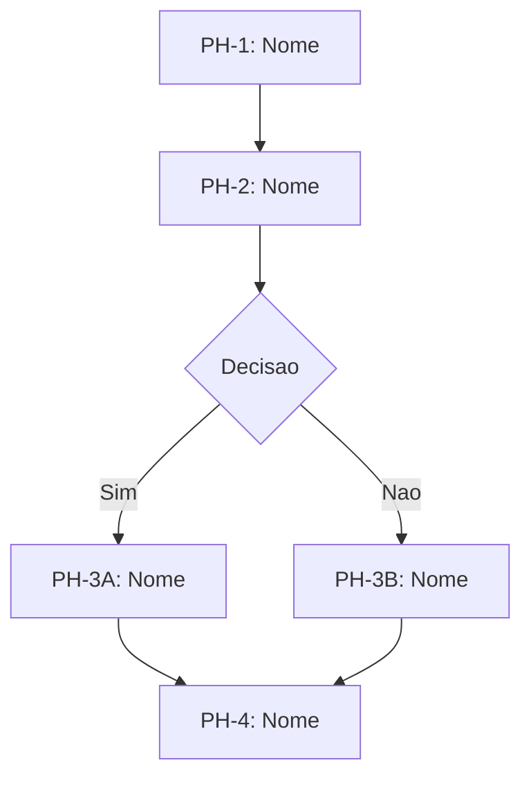

# P2: PROTOCOLO DE ARQUITETURA

> Desenhar a maquina que vai executar a intencao

**Versao:** 1.0.0
**Gate de Saida:** G2 - A arquitetura e logica e executavel?
**Referencia:** docs/architecture/02-PROTOCOLS.md

---

## Objetivo

Transformar a Intent Specification em uma **Execution Architecture** completa - um design de como o trabalho sera executado, incluindo fases, agentes, workflows e pontos de decisao.

---

## Entrada

- Intent Specification validada (G1 PASSED)
- `intent-spec.yaml`

---

## Saida

- `exec-arch.yaml` completo e validado
- Diagrama Mermaid do workflow
- Gate G2 PASSED

---

## Processo de Execucao

### Passo 2.1: Analise de Complexidade

Classificar a complexidade para determinar o nivel de arquitetura necessario:

| Complexidade | Caracteristicas | Arquitetura |
|--------------|-----------------|-------------|
| **LOW** | Tarefa unica, linear, sem dependencias | Simples: 1-2 fases |
| **MEDIUM** | Multiplas etapas, algumas dependencias | Moderada: 3-4 fases |
| **HIGH** | Multi-agente, dependencias cruzadas | Elaborada: 5-7 fases |
| **EXTREME** | Sistema completo, multiplos workflows | Complexa: Framework proprio |

### Passo 2.2: Design de Fases

Definir as fases de execucao:

```yaml
phases:
  - id: "PH-1"
    name: "Nome da Fase"
    objective: "O que esta fase realiza"
    inputs:
      - name: "Nome do input"
        source: "De onde vem"
        required: true
    outputs:
      - name: "Nome do output"
        format: "md | yaml | json"
        destination: "Para onde vai"
    gate:
      id: "G-PH1"
      question: "Criterio para avancar"
      criteria:
        - "Criterio 1"
        - "Criterio 2"
```

**Regras de Design:**
- Cada fase tem um objetivo unico e claro
- Inputs e outputs sao explicitos
- Toda fase termina com um gate

### Passo 2.3: Definicao de Agentes

Se a execucao requer multiplos "agentes cognitivos":

```yaml
agents:
  - id: "AGT-1"
    name: "Nome do Agente"
    type: "THINKER | DOER | VALIDATOR | HYBRID"
    role: "Papel do agente"
    expertise:
      - "Area de conhecimento 1"
      - "Area de conhecimento 2"
    responsibilities:
      - "Responsabilidade 1"
      - "Responsabilidade 2"
    invoked_in:
      - phase: "PH-1"
        purpose: "Por que e invocado nesta fase"
```

**Regras de Design:**
- Cada agente tem uma especialidade unica
- Agentes nao competem, colaboram
- Sempre definir quando o agente e invocado

### Passo 2.4: Design de Workflow

Mapear o fluxo de execucao:

```yaml
workflow:
  type: "LINEAR | PARALLEL | CONDITIONAL | ITERATIVE | HYBRID"

  flow:
    - step: 1
      phase: "PH-1"
      agents: ["AGT-1"]
      parallel: false
      condition: null

    - step: 2
      phase: "PH-2"
      agents: ["AGT-2", "AGT-3"]
      parallel: true
      condition: "Apos G-PH1 PASS"
```

**Tipos de Workflow:**

| Tipo | Uso | Exemplo |
|------|-----|---------|
| LINEAR | Etapas sequenciais | A -> B -> C |
| PARALLEL | Etapas simultaneas | A -> (B,C) -> D |
| CONDITIONAL | Decisao entre caminhos | A -> {se X: B, se Y: C} |
| ITERATIVE | Loops ate condicao | A -> [B -> C]* -> D |
| HYBRID | Combinacao | Complexo |

### Passo 2.5: Identificacao de Pontos de Decisao

Mapear onde decisoes humanas sao necessarias:

```yaml
decision_points:
  - id: "DP-1"
    after_phase: "PH-2"
    type: "HUMAN | AUTOMATIC | HYBRID"
    question: "Pergunta que o operador deve responder"
    options:
      - id: "A"
        label: "Opcao A"
        leads_to: "PH-3A"
        criteria: "Quando escolher esta opcao"
      - id: "B"
        label: "Opcao B"
        leads_to: "PH-3B"
        criteria: "Quando escolher esta opcao"
    default: "A"
```

### Passo 2.6: Mapeamento de Recursos

```yaml
resources:
  tools:
    - name: "Nome da ferramenta"
      purpose: "Para que sera usada"
      required: true

  mcps:
    - name: "Nome do MCP"
      purpose: ""
      config: ""

  knowledge_bases:
    - name: "Nome"
      path: ""
      purpose: ""

  files:
    - path: ""
      purpose: ""
      access: "read | write | both"
```

### Passo 2.7: Analise de Riscos

```yaml
risks:
  - id: "R-1"
    description: "Descricao do risco"
    probability: "LOW | MEDIUM | HIGH"
    impact: "LOW | MEDIUM | HIGH"
    mitigation: "Como mitigar"
    contingency: "Plano B se acontecer"
```

### Passo 2.8: Geracao do Diagrama

Criar diagrama Mermaid do workflow:



---

## Gate G2: Validacao de Arquitetura

**Pergunta Central:** A arquitetura e logica e executavel?

### Checklist de Validacao

| Criterio | Peso | Verificacao |
|----------|------|-------------|
| Fases sao sequenciaveis? | CRITICO | Nao ha dependencias circulares? |
| Outputs alimentam inputs? | CRITICO | Cada fase recebe o que precisa? |
| Agentes estao definidos? | ALTO | Cada agente tem papel claro? |
| Pontos de decisao mapeados? | ALTO | Sabemos onde o operador interve? |
| Recursos estao disponiveis? | MEDIO | Temos acesso a tudo necessario? |

### Regra de Passagem

- Todos os criterios CRITICO e ALTO devem ser atendidos
- Criterios MEDIO sao desejaveis

### Se Falhar

1. Identificar quais criterios falharam
2. Revisar a arquitetura
3. Ajustar fases/agentes/workflow
4. Re-executar Gate G2

---

## Output Template

Ver: `templates/blueprints/EXEC-ARCH.yaml`

---

## Padroes de Arquitetura

### Padrao: Pipeline Linear

```
INPUT -> [FASE 1] -> [FASE 2] -> [FASE 3] -> OUTPUT
```

Usar quando: Etapas claras e sequenciais, sem loops.

### Padrao: Fork-Join

```
        -> [FASE 2A] -
INPUT -> |             | -> OUTPUT
        -> [FASE 2B] -
```

Usar quando: Partes podem ser executadas em paralelo.

### Padrao: Loop Iterativo

```
INPUT -> [FASE 1] -> [FASE 2] -?-> OUTPUT
              ^          |
              |__________|
```

Usar quando: Refinamento iterativo ate atingir qualidade.

### Padrao: Decision Tree

```
INPUT -> [FASE 1] -> {DECISAO} -> [CAMINHO A] -> OUTPUT
                        |
                        -> [CAMINHO B] -> OUTPUT
```

Usar quando: Caminhos diferentes baseado em condicoes.

---

## Checklist Final

Antes de passar para P3:

- [ ] Complexidade classificada
- [ ] Fases definidas com inputs/outputs
- [ ] Agentes definidos (se aplicavel)
- [ ] Workflow desenhado
- [ ] Pontos de decisao mapeados
- [ ] Recursos listados
- [ ] Riscos identificados
- [ ] Diagrama Mermaid gerado
- [ ] Gate G2 PASSED
- [ ] STATE.yaml atualizado

---

*"Uma boa arquitetura torna a execucao obvia." - ATHENA*
